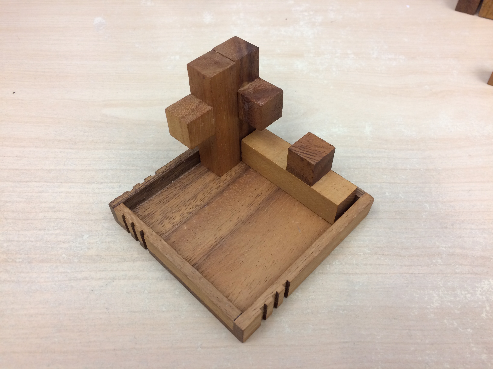
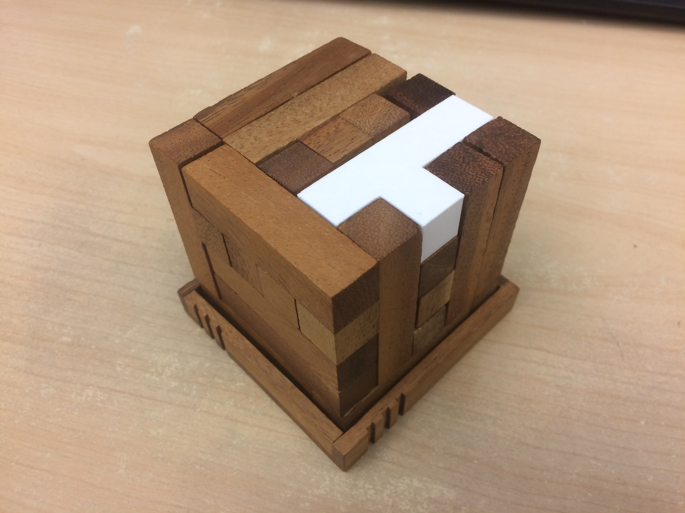

# 25PieceCubePuzzle
Instructions:
clone, make, and run `./puzzle` and view results in `output.txt`
The output file is as though, once the cube was assembled, it were sliced into 5 levels then laid out from bottom to top. The 
numbers in each cell represent the pieces of each wooden block found on that layer. Try and visiualize all 5 layers immediately ontop of one another.
```
Level: 1        Level: 2         Level: 3         Level: 4         Level: 5
1  2  2  2  2   1  4  11 2  12   1  1  11 6  12   1  11 11 12 12   21 24 11 25 12 
3  4  5  6  7   3  4  13 6  14   3  4  13 6  14   3  4  13 6  14   21 24 13 25 14 
5  5  5  5  7   8  15 15 15 15   3  9  13 15 14   21 22 22 22 22   21 24 24 25 25
8  9  10 7  7   8  9  16 17 18   8  9  16 20 18   8  9  16 22 18   21 24 16 25 18 
10 10 10 10 7   19 17 17 17 17   19 20 20 20 20   19 19 16 23 18   19 23 23 23 23 
```

The block puzzle consists of 25 blocks shaped and arranged in this manner:



The blocks are composed of 5 "units" the cube is 5x5x5
There are 72 different ways to lay a block from any given starting cell.
The puzzle requires that no cells remain empty, every cell must be occupied by a unit from a cell.
There are 125 cells in the cube. This program tries every possible combination recursively and halts when a valid
combination is found.

The program needed to lay down 25 blocks in the proper sequence in order to satisfy the requirements of the cube. I am not sure
how to represent, how many attempts it made but there were 111,851,005 blocks that were removed after being laid down. So if
you want to call laying a block an attempt, then the program made 111 million attempts before finding the proper solution. All
of this in just 2 and a half minutes!

Here is the assembled puzzle per the instructions generated by the program. (We 3D printed the last missing piece).


.gif)
